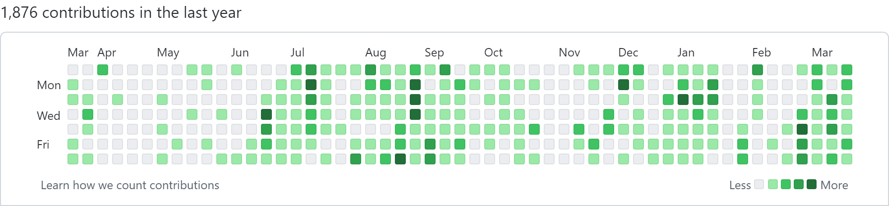

<samp>

github_grass_fetcher
===

This is a simple script to take a screenshot of a GitHub user's yearly contributions graph.

Usage
---

    $ go run main.go -user <username> -out <output file>

Example Image
---

</samp>
